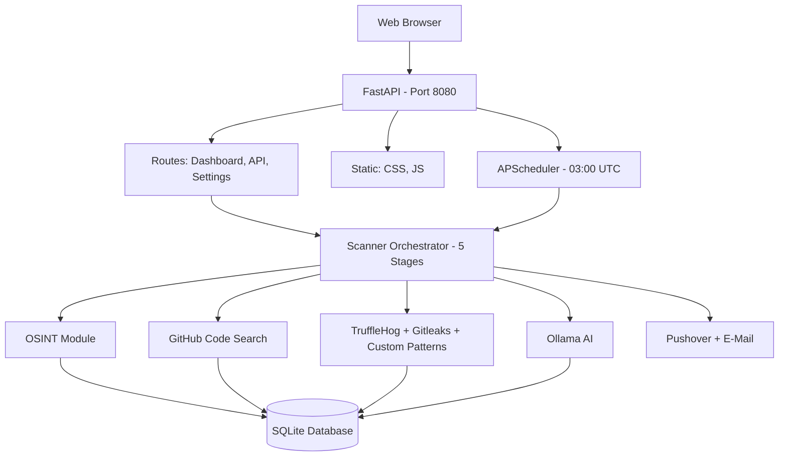

# Ice-Leak-Monitor - Adminhandbuch

## Architektur



---

## Datenbank-Schema

### Tabellen

| Tabelle | Beschreibung |
|---------|-------------|
| `keywords` | Suchbegriffe mit Kategorie und Status |
| `scans` | Scan-Ausfuehrungen mit Statistiken |
| `discovered_repos` | Entdeckte GitHub-Repositories |
| `findings` | Security-Findings (Secrets, Credentials) |
| `repo_keyword_matches` | Verknuepfung Repo <-> Keyword |
| `notification_logs` | Versendete Benachrichtigungen |
| `module_settings` | OSINT-Modul-Konfiguration |
| `osint_results` | OSINT-Aufklaerungsergebnisse |

### module_settings

```sql
CREATE TABLE module_settings (
    id          INTEGER PRIMARY KEY,
    module_key  TEXT UNIQUE NOT NULL,  -- z.B. "subfinder"
    display_name TEXT NOT NULL,
    description TEXT,
    is_enabled  INTEGER DEFAULT 0,     -- 0=aus, 1=an
    config_json TEXT,                   -- z.B. {"api_key":"..."}
    updated_at  TEXT
);
```

### osint_results

```sql
CREATE TABLE osint_results (
    id            INTEGER PRIMARY KEY,
    scan_id       INTEGER REFERENCES scans(id),
    module_key    TEXT NOT NULL,
    keyword_used  TEXT NOT NULL,
    result_type   TEXT,    -- subdomain, email, person, ip, leak, github_dork
    result_value  TEXT NOT NULL,
    metadata_json TEXT,
    created_at    TEXT
);
```

---

## Scan-Pipeline (5 Stages)

### Stage 0: Vorbereitung
- Aktive Keywords aus der DB laden
- Scan-Record erstellen (Status: running)

### Stage 1: OSINT-Aufklaerung
- Alle aktivierten Module aus `module_settings` laden
- Fuer jedes Modul: Keywords filtern (Domain, E-Mail, Company)
- Module sequentiell ausfuehren
- Ergebnisse in `osint_results` speichern
- Neue Keywords (E-Mails, Subdomains, Personen) extrahieren
- Keywords-Liste erweitern und deduplizieren

### Stage 2: GitHub Code Search
- GitHub Search API fuer jedes Keyword
- Repos upserten, RepoKeywordMatch-Records erstellen
- Repo-Details abrufen (Groesse, Sprache, Stars, pushed_at)
- `github_pushed_at` im Repo-Record speichern

### Stage 3: Repo-Analyse (Per-Repo-Verarbeitung)

Jedes Repo wird einzeln komplett abgearbeitet. Findings erscheinen sofort im Dashboard nach jedem `db.commit()`.

**Skip-Logik (Entscheidungsbaum pro Repo):**

1. **Dismissed** → Uebersprungen
2. **Zu gross** (> max_repo_size_mb) → Uebersprungen (scan_status="skipped")
3. **User-gesperrt** (ai_scan_enabled=0) → Uebersprungen
4. **User-erzwungen** (ai_scan_enabled=1) → Scan ohne AI-Check
5. **AI-Check** (ai_scan_enabled=NULL) → Ollama Relevanz-Score; < 0.3 → Uebersprungen (low_relevance)
6. **Unveraendert** (pushed_at <= last_scanned_at) → Uebersprungen (scan_status="unchanged")
7. Alle Checks bestanden → **Deep Scan** + **AI-Assessment**

**Deep Scan:**
- TruffleHog (Remote-Scan, kein Clone noetig)
- Git Clone (shallow, depth=1)
- Gitleaks (auf geklontem Repo)
- Custom Patterns (auf geklontem Repo)
- Finding-Deduplizierung per SHA256-Hash

**AI-Assessment (pro Repo):**
- Ollama-Bewertung jedes neuen Findings
- MITRE ATT&CK, DORA, BaFin-Kontext
- `db.commit()` nach jedem Repo → sofort im Dashboard sichtbar

### Stage 4: Abschluss
- Pushover-Benachrichtigung (bei neuen Findings)
- E-Mail-Benachrichtigung
- Scan-Record finalisieren

### Neue Felder auf discovered_repos

| Feld | Typ | Beschreibung |
|------|-----|-------------|
| `github_pushed_at` | TEXT | GitHub's pushed_at Timestamp (ISO) — wann das Repo zuletzt geaendert wurde |
| `ai_scan_enabled` | INTEGER | NULL=KI entscheidet, 0=User sperrt Scan, 1=User erzwingt Scan |

---

## OSINT-Module im Detail

### Blackbird
- **Funktion:** Sucht nach Accounts auf 200+ Plattformen
- **Input:** Keywords (als Username oder E-Mail)
- **Output:** Account-URLs, Plattformnamen
- **Tool:** Python-Script `/opt/blackbird/blackbird.py`
- **Dependencies:** Im Docker-Image vorinstalliert

### Subfinder
- **Funktion:** Subdomain-Enumeration per DNS/CT-Logs
- **Input:** Domain-Keywords (z.B. "beispiel.de")
- **Output:** Subdomains (z.B. "mail.beispiel.de", "vpn.beispiel.de")
- **Tool:** Go-Binary `/usr/local/bin/subfinder`
- **Neue Keywords:** Ja (Subdomains werden als Keywords hinzugefuegt)

### theHarvester
- **Funktion:** Sammelt E-Mails, Hosts, IPs per Suchmaschinen
- **Input:** Domain-Keywords
- **Output:** E-Mail-Adressen, Hostnamen, IP-Adressen
- **Quellen:** Baidu, Bing, DuckDuckGo, Yahoo, crt.sh, DNSDumpster, HackerTarget
- **Neue Keywords:** Ja (E-Mails und Hosts)

### CrossLinked
- **Funktion:** LinkedIn-Suche nach Mitarbeitern
- **Input:** Company-Keywords (ohne Punkte, ohne @)
- **Output:** Personennamen, Jobtitel, LinkedIn-URLs
- **Limit:** Max. 3 Keywords pro Scan (Rate-Limiting)
- **Neue Keywords:** Ja (Personennamen)

### Hunter.io
- **Funktion:** E-Mail-Adressen per Domain finden
- **Input:** Domain-Keywords + API-Key
- **Output:** E-Mail-Adressen, Organisation, E-Mail-Patterns
- **API:** `https://api.hunter.io/v2/domain-search`
- **Kosten:** Free-Tier: 25 Requests/Monat
- **Neue Keywords:** Ja (gefundene E-Mails)

### GitDorker
- **Funktion:** GitHub Dork-Suche nach Secrets
- **Input:** Keywords + GitHub Token
- **Output:** Repos/Dateien die Dork-Patterns matchen
- **Patterns:** .env, credentials, password, api_key, token, private_key, etc.
- **Limit:** Max. 5 Keywords, 2s Pause zwischen Queries

### LeakCheck
- **Funktion:** E-Mail/Domain in Datenlecks pruefen
- **Input:** E-Mail/Domain-Keywords + API-Key
- **Output:** Breach-Quellen, Breach-Daten
- **API:** `https://leakcheck.io/api/v2`
- **Kosten:** Kostenpflichtiger Service

---

## Umgebungsvariablen

| Variable | Standard | Beschreibung |
|----------|----------|-------------|
| `GITHUB_TOKEN` | (leer) | GitHub PAT fuer API-Zugriff |
| `PUSHOVER_USER_KEY` | (leer) | Pushover User Key |
| `PUSHOVER_API_TOKEN` | (leer) | Pushover API Token |
| `SMTP_HOST` | (leer) | SMTP Server |
| `SMTP_PORT` | 25 | SMTP Port |
| `SMTP_USERNAME` | (leer) | SMTP Benutzername |
| `SMTP_PASSWORD` | (leer) | SMTP Passwort |
| `ALERT_EMAIL_FROM` | (leer) | Absender-Adresse |
| `ALERT_EMAIL_TO` | (leer) | Empfaenger-Adresse |
| `OLLAMA_BASE_URL` | http://localhost:11434 | Ollama API URL |
| `OLLAMA_MODEL` | llama3 | Ollama Modell |
| `BLACKBIRD_ENABLED` | true | Blackbird aktivieren (Legacy, migriert zu DB) |
| `SCAN_SCHEDULE_HOUR` | 3 | Scan-Zeitplan Stunde (UTC) |
| `SCAN_SCHEDULE_MINUTE` | 0 | Scan-Zeitplan Minute |
| `TRUFFLEHOG_TIMEOUT` | 300 | TruffleHog Timeout (Sekunden) |
| `GITLEAKS_TIMEOUT` | 300 | Gitleaks Timeout (Sekunden) |
| `MAX_REPO_SIZE_MB` | 500 | Max. Repo-Groesse zum Scannen |
| `SECRET_KEY` | change-me | App Secret Key |
| `DB_PATH` | /data/iceleakmonitor.db | Datenbank-Pfad |
| `TZ` | UTC | Zeitzone |

---

## API-Endpunkte

### Scan-Steuerung

| Methode | Pfad | Beschreibung |
|---------|------|-------------|
| POST | `/api/scans/trigger` | Manuellen Scan starten |
| POST | `/api/scans/cancel` | Laufenden Scan abbrechen |
| GET | `/api/scans/status` | Letzter Scan-Status |
| GET | `/api/scans/progress` | Live-Fortschritt (fuer Polling) |
| GET | `/api/stats` | Gesamt-Statistiken |

### Modul-Verwaltung

| Methode | Pfad | Beschreibung |
|---------|------|-------------|
| GET | `/settings` | Einstellungsseite |
| POST | `/settings/modules/{key}/toggle` | Modul an/aus |
| POST | `/settings/modules/{key}/config` | API-Key speichern |

### Repositories

| Methode | Pfad | Beschreibung |
|---------|------|-------------|
| POST | `/repos/{id}/ai-override` | AI-Scan-Override (Body: `{"ai_scan_enabled": 0\|1\|null}`) |
| POST | `/repos/{id}/dismiss` | Repo als False Positive markieren/entmarkieren |

### Keywords

| Methode | Pfad | Beschreibung |
|---------|------|-------------|
| GET | `/keywords` | Keywords-Seite |
| POST | `/keywords` | Keyword hinzufuegen |
| PATCH | `/keywords/{id}` | Keyword aktivieren/deaktivieren |
| DELETE | `/keywords/{id}` | Keyword loeschen |

---

## Wartung

### Logs pruefen

```bash
docker compose logs --tail=100 -f
```

### Datenbank-Groesse pruefen

```bash
ls -lh data/iceleakmonitor.db
```

### Datenbank bereinigen

```bash
# Alte Scans loeschen (aelter als 90 Tage)
docker compose exec iceleakmonitor sqlite3 /data/iceleakmonitor.db \
  "DELETE FROM scans WHERE finished_at < datetime('now', '-90 days');"

# Datenbank komprimieren
docker compose exec iceleakmonitor sqlite3 /data/iceleakmonitor.db "VACUUM;"
```

### Container-Update

```bash
git pull
docker compose up -d --build
```

### Health-Check

```bash
curl http://localhost:8084/api/stats
```

---

## Sicherheitshinweise

- `.env`-Datei niemals in Git einchecken
- GitHub Token mit minimalen Berechtigungen verwenden
- API-Keys (Hunter.io, LeakCheck) regelmaessig rotieren
- Zugriff auf Port 8084 per Firewall einschraenken
- Fuer Produktiv-Einsatz: Reverse Proxy mit HTTPS (nginx/Traefik)
- SQLite-DB enthaelt ggf. sensible Daten - Dateisystem-Berechtigungen pruefen

---

## Technologie-Stack

| Komponente | Technologie |
|------------|-------------|
| Backend | FastAPI (Python 3.12) |
| Datenbank | SQLite mit WAL-Modus |
| ORM | SQLAlchemy 2.0 |
| Frontend | Jinja2 Templates, Vanilla JS |
| Scheduler | APScheduler |
| Scanner | TruffleHog, Gitleaks, Custom Patterns |
| OSINT | Blackbird, Subfinder, theHarvester, CrossLinked, Hunter.io, GitDorker, LeakCheck |
| AI | Ollama (llama3 / beliebiges LLM) |
| Container | Docker, Docker Compose |
| Benachrichtigungen | Pushover, SMTP E-Mail |
